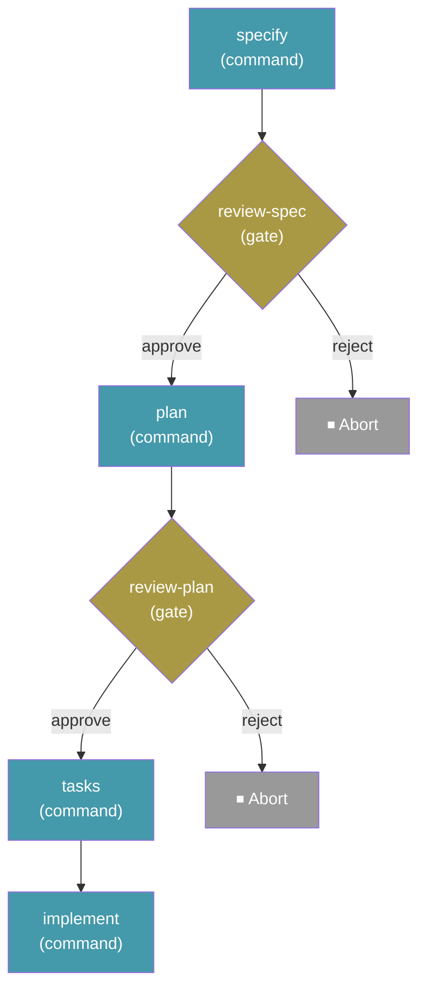

# Workflows

> 本文是 [英文原文](workflows.md) 的中文翻译。命令、YAML 键名、表达式和代码示例保持原样。

Workflow 把多步骤规格驱动开发过程自动化，将命令、提示词、Shell 步骤和人工检查点串联成可重复执行的序列。它支持条件逻辑、循环、扇出/扇入，并且可以在中断位置准确暂停和恢复。

## 运行 Workflow

```bash
specify workflow run <source>
```

| 选项 | 说明 |
| --- | --- |
| `-i` / `--input` | 以 `key=value` 形式传入输入值，可重复使用 |
| `--json` | 将运行结果输出为单个 JSON 对象 |

从 Catalog ID、URL 或本地文件路径运行 Workflow。Workflow 声明的输入可以通过 `--input` 提供，也可以在交互模式中输入。

示例：

```bash
specify workflow run speckit -i spec="Build a kanban board with drag-and-drop task management" -i scope=full
```

使用 `--json` 时，命令输出单个机器可读对象，而不是格式化文本；省略该选项时，默认输出保持不变：

```bash
specify workflow run my-pipeline.yml --json
```

```json
{
  "run_id": "662bf791",
  "workflow_id": "build-and-review",
  "status": "paused",
  "current_step_id": "review",
  "current_step_index": 0
}
```

`workflow_id` 是 YAML 中 `workflow.id` 声明的值，而不是文件名。该对象会严格按照上面的形式输出：使用两个空格缩进进行美化，不包含 Rich 标记，直接写入标准输出，因此始终可以解析。在 `--json` 模式下运行 Workflow 时，Step 原本会输出的进度信息，例如 Gate 提示或 Prompt Step 的 CLI 子进程输出，会被重定向到标准错误，因此标准输出只包含 JSON 对象。请从标准输出读取对象，并让标准错误继续连接终端，或者单独捕获。

> **注意：** 大多数 Workflow 命令要求项目已经通过 `specify init` 初始化。例外是 `specify workflow run <local-file.{yml,yaml}>`，它可以在项目外运行；此时运行状态保存在当前目录的 `.specify/workflows/runs/<run_id>/` 下。

## 恢复 Workflow

```bash
specify workflow resume <run_id>
```

| 选项 | 说明 |
| --- | --- |
| `-i` / `--input` | 以 `key=value` 形式更新输入值，可重复使用 |
| `--json` | 将恢复结果输出为单个 JSON 对象 |

从暂停或失败时所在的准确 Step 恢复 Workflow。它适合在响应 Gate Step 或修复导致失败的问题后使用。

通过 `--input` 提供的值会覆盖运行记录中保存的输入，并根据 Workflow 输入类型重新校验；随后被阻塞的 Step 会使用新值重新执行。这样，运行过程就能使用暂停后才获得的信息继续执行，或者在失败后使用修正值重试：

```bash
specify workflow resume <run_id> --input cmd="exit 0"
```

## Workflow 状态

```bash
specify workflow status [<run_id>]
```

| 选项 | 说明 |
| --- | --- |
| `--json` | 将运行状态或运行列表输出为 JSON 对象 |

显示指定运行的状态；不提供 ID 时列出所有运行。运行状态包括：`created`、`running`、`completed`、`paused`、`failed`、`aborted`。

## 列出已安装 Workflow

```bash
specify workflow list
```

列出当前项目已经安装的 Workflow。

## 安装 Workflow

```bash
specify workflow add <source>
```

从 Catalog、URL（必须使用 HTTPS）或本地文件路径安装 Workflow。

## 移除 Workflow

```bash
specify workflow remove <workflow_id>
```

从项目中移除已安装的 Workflow。

## 搜索可用 Workflow

```bash
specify workflow search [query]
```

| 选项 | 说明 |
| --- | --- |
| `--tag` | 按标签筛选 |

在所有已激活 Catalog 中搜索与查询条件匹配的 Workflow。

## Workflow 信息

```bash
specify workflow info <workflow_id>
```

显示 Workflow 的详细信息，包括 Step、输入和要求。

## Catalog 管理

Workflow Catalog 决定 `search` 和 `add` 到哪里查找 Workflow。Catalog 按优先级顺序检查。

### 列出 Catalog

```bash
specify workflow catalog list
```

显示所有已激活的 Catalog 来源。

### 添加 Catalog

```bash
specify workflow catalog add <url>
```

| 选项 | 说明 |
| --- | --- |
| `--name <name>` | Catalog 的可选名称 |

向项目的 `.specify/workflow-catalogs.yml` 添加自定义 Catalog URL。

### 移除 Catalog

```bash
specify workflow catalog remove <index>
```

根据 Catalog 列表中的索引移除 Catalog。

### Catalog 解析顺序

Catalog 按以下顺序解析，首次匹配即停止：

1. **环境变量**：`SPECKIT_WORKFLOW_CATALOG_URL` 覆盖所有 Catalog。
2. **项目配置**：`.specify/workflow-catalogs.yml`。
3. **用户配置**：`~/.specify/workflow-catalogs.yml`。
4. **内置默认值**：官方 Catalog 和社区 Catalog。

## Workflow 定义

Workflow 使用 YAML 文件定义。下面是 Spec Kit 自带的 **Full SDD Cycle** Workflow：

```yaml
schema_version: "1.0"
workflow:
  id: "speckit"
  name: "Full SDD Cycle"
  version: "1.0.0"
  author: "GitHub"
  description: "Runs specify → plan → tasks → implement with review gates"

requires:
  speckit_version: ">=0.7.2"
  integrations:
    any: ["copilot", "claude", "gemini"]

inputs:
  spec:
    type: string
    required: true
    prompt: "Describe what you want to build"
  integration:
    type: string
    default: "copilot"
    prompt: "Integration to use (e.g. claude, copilot, gemini)"
  scope:
    type: string
    default: "full"
    enum: ["full", "backend-only", "frontend-only"]

steps:
  - id: specify
    command: speckit.specify
    integration: "{{ inputs.integration }}"
    input:
      args: "{{ inputs.spec }}"

  - id: review-spec
    type: gate
    message: "Review the generated spec before planning."
    options: [approve, reject]
    on_reject: abort

  - id: plan
    command: speckit.plan
    integration: "{{ inputs.integration }}"
    input:
      args: "{{ inputs.spec }}"

  - id: review-plan
    type: gate
    message: "Review the plan before generating tasks."
    options: [approve, reject]
    on_reject: abort

  - id: tasks
    command: speckit.tasks
    integration: "{{ inputs.integration }}"
    input:
      args: "{{ inputs.spec }}"

  - id: implement
    command: speckit.implement
    integration: "{{ inputs.integration }}"
    input:
      args: "{{ inputs.spec }}"
```

它会产生下面的执行流程：



运行命令：

```bash
specify workflow run speckit -i spec="Build a kanban board with drag-and-drop task management"
```

## Step 类型

| 类型 | 用途 |
| --- | --- |
| `command` | 调用 Spec Kit 命令，例如 `speckit.plan` |
| `prompt` | 向 AI 编程 Agent 发送任意提示词 |
| `shell` | 执行 Shell 命令并捕获输出 |
| `init` | 初始化项目，类似 `specify init` |
| `gate` | 继续前暂停，等待人工批准 |
| `if` | 条件分支（then/else） |
| `switch` | 根据表达式进行多分支调度 |
| `while` | 条件为真时循环 |
| `do-while` | 至少执行一次，再根据条件循环 |
| `fan-out` | 对列表中的每个元素调度一个 Step |
| `fan-in` | 聚合 fan-out Step 的结果 |

> **安全说明：** `shell` Step 使用**当前用户**权限执行本地命令。系统不存在能力沙箱。`requires` 只是建议性的前置条件块，例如 Spec Kit 版本和 Integration，并不是运行时门禁，因此它**不会**限制 Step 可以执行的操作。尤其不存在 `requires.permissions` 能力门禁；校验会拒绝它，正是因为它会让人误以为存在实际上并不存在的沙箱。运行 Catalog 或下载的 Workflow 前，请先审查源码；对敏感或破坏性 Shell 命令，使用 `gate` Step 要求明确批准。

## 表达式

Step 可以使用 `{{ expression }}` 语法引用输入和之前 Step 的输出：

| 命名空间 | 说明 |
| --- | --- |
| `inputs.spec` | Workflow 输入值 |
| `steps.specify.output.file` | 前一个 Step 的输出 |
| `item` | fan-out 迭代中的当前元素 |

可用过滤器包括：`default`、`join`、`contains`、`map`、`from_json`。

示例：

```yaml
condition: "{{ steps.test.output.exit_code == 0 }}"
args: "{{ inputs.spec }}"
message: "{{ status | default('pending') }}"
```

## 输入类型

| 类型 | 转换方式 |
| --- | --- |
| `string` | 原样传递 |
| `number` | `"42"` → `42`，`"3.14"` → `3.14` |
| `boolean` | `"true"` / `"1"` / `"yes"` → `True` |

## 状态和恢复

每次 Workflow 运行都把状态持久化到 `.specify/workflows/runs/<run_id>/`：

- `state.json`：当前运行状态和 Step 进度。
- `inputs.json`：解析后的输入值。
- `log.jsonl`：逐 Step 执行日志。

因此，`specify workflow resume` 可以从暂停或失败时所在的准确 Step 继续执行，例如停在 Gate 时。

## 常见问题

### Workflow 遇到 Gate Step 时会发生什么？

Workflow 会暂停并等待人工输入。完成审查后运行 `specify workflow resume <run_id>` 继续。

### 可以多次运行同一个 Workflow 吗？

可以。每次运行都有唯一 ID 和独立状态目录。使用 `specify workflow status` 查看所有运行。

### 谁负责维护 Workflow？

大多数 Workflow 由各自作者独立创建和维护。Spec Kit 维护者不会审查、审核、认可或支持 Workflow 代码。安装前请检查 Workflow 源码，并自行判断是否使用。
